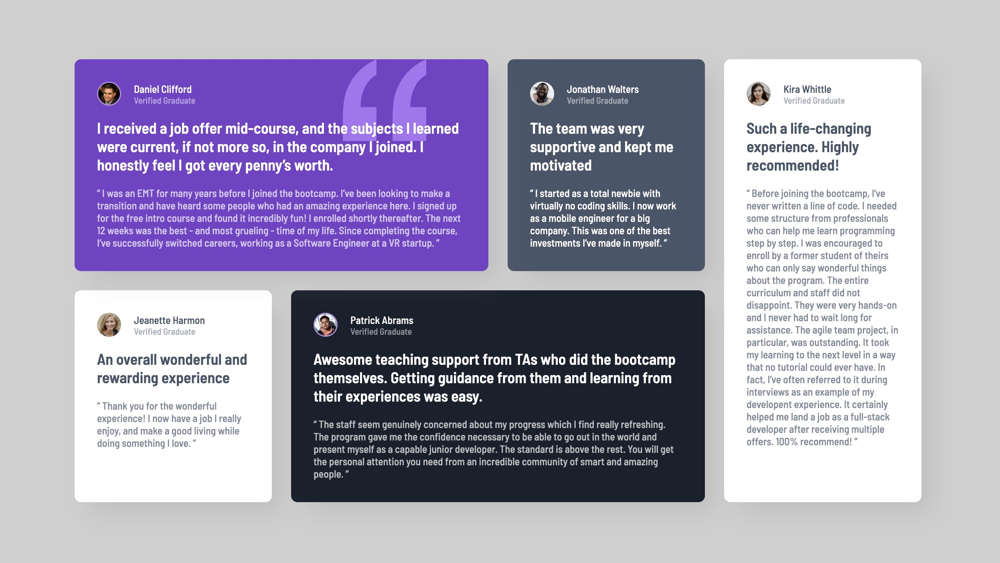

# Frontend Mentor - Testimonials grid section solution

This is a solution to the [Testimonials grid section challenge on Frontend Mentor](https://www.frontendmentor.io/challenges/testimonials-grid-section-Nnw6J7Un7). Frontend Mentor challenges help you improve your coding skills by building realistic projects.

### Links

- Solution URL: [Solution](https://www.frontendmentor.io/solutions/responsive-testimonials-grid-KXP9avHm5C)
- Live Site URL: [Live](https://singhfatehbir.github.io/testimonials-grid-section-FEM/)

### The challenge

Users should be able to:

- View the optimal layout for the site depending on their device's screen size

### Screenshot

## My process

### Built with

- Semantic HTML5 markup
- CSS custom properties
- Flexbox
- CSS Grid
- Mobile-first workflow

## Author

- Frontend Mentor - [@fa7eh](https://www.frontendmentor.io/profile/fa7eh)
